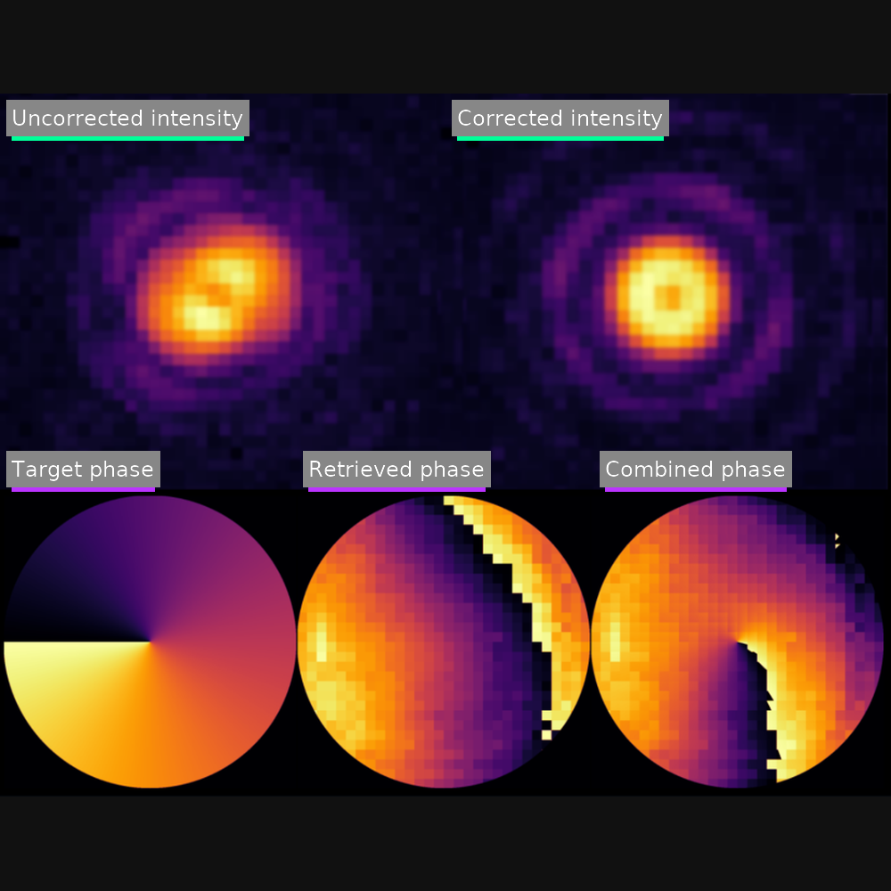

# slm-phase-retrieval


Python-based phase and amplitude retrieval for LCOS-SLM characterization and calibration, adapted for Hamamatsu X15213 and related lab setups.

---

## ✨ Overview

This repository implements an optical wavefront retrieval algorithm based on interferometric grating patch methods. It enables correction of SLM-induced and optical aberrations for high-fidelity phase holography.

Adapted from:

- Phillip Zupancic (https://doi.org/10.1364/OE.24.013881)
- Schroff et al., *Scientific Reports* (https://doi.org/10.1038/s41598-023-30296-6)
- [Original `hologradpy` implementation](https://github.com/paul-schroff/hologradpy)

This version is fully adapted to a USB-connected LCOS SLM (Hamamatsu X15213) and integrates directly with a Hamamatsu ORCA camera and Thorlabs SC10 shutter.

---

## 📦 Repo Structure

```
slm-phase-retrieval/
├── .github/
│   └── workflows/
│       └── python-install.yml                 # CI workflow (drives the README badge)
├── assets/
│   ├── phase_collage_square.png              # 1000×1000 (README Results)
│   ├── phase_collage_wide.png                # 1280×720 (general wide)
│   └── phase_collage_wide_social.png         # 1280×640 (GitHub social preview)
├── function_scripts/
│   ├── fitting.py                             # Sine and Gaussian fitting routines
│   ├── helpers.py                             # Normalization, meshgrid, utilities
│   ├── phase_gen.py                           # Phase pattern generation (gratings, corrections)
│   └── slmphase.py                            # Main retrieval class
├── orca/
│   └── orca_camera.py                         # ORCA Flash v3 USB interface
├── peripheral_instruments/
│   └── thorlabs_shutter.py                    # USB control for SC10 shutter
├── slm/
│   ├── corr_patties/
│   │   └── CAL_LSH0803420_750nm.bmp           # Manufacturer correction pattern
│   ├── demo_slm_upload_grating_and_correction.py  # Phase upload demonstration
│   └── slm_hamamatsu.py                       # Hamamatsu SLM USB control (X15213 LCOS)
├── tests/
│   ├── orca_speed_test_vs_cam_PrepMode.py     # Acquisition speed test
│   ├── slm_speed_test.py                      # SLM phase upload benchmark
│   └── test_correction_by_lg.py               # Example LG-beam result viewer
├── LICENSE                                    # Project license
├── README.md                                  # Project overview & docs
├── main_phase_amplitude_retrieval.py          # Top-level phase retrieval routine
└── requirements.txt                           # Python dependencies
```


---

## ⚙️ Hardware Requirements

- **SLM**: Hamamatsu X15213 (LCOS, USB interface)
- **Camera**: Hamamatsu ORCA Flash v3
- **Shutter**: Thorlabs SC10 (serial over USB)

---

## 🚀 Quick Demo

The script `slm/demo_slm_upload_grating_and_correction.py` demonstrates:

- Loading a correction phase pattern from a `.bmp`
- Generating a basic grating
- Uploading the combined phase to the SLM

This serves as a proof of working USB control and calibration-phase logic.

---

## 📐 Main Retrieval Logic

The core functionality is implemented in `function_scripts/slmphase.py` and:

1. Displays structured gratings on the SLM
2. Measures interferograms via a known patch structure
3. Computes relative phase across the SLM
4. Optionally fits amplitude (from arm interference)
5. Stores correction maps and Gaussian fits

Backgrounds are measured and removed either by shutter or by using a flat-phase mask with suppressed diffraction.

---

## Results

<p align="center">
  
</p>

**What you’re seeing**

- **Top row:** Uncorrected → Corrected **intensity** (labels flush-left; teal underline).
- **Bottom row:** **Target** → **Retrieved** → **Combined** **phase** (labels flush-left; purple underline).
- Styling matches our shared theme: dark `#111111`, accents `#00FF99` / `#BB33FF`.

> Widescreen asset for social sharing: `assets/phase_collage_wide.png`.

---

## 🔭 Future Work

Planned improvements include:

- Adding Python type annotations across the codebase
- Inlining phase generation logic into `slmphase.py`
- Including real LG donut test result in `tests/`
- Replacing placeholder phase_gen logic with full pattern generation code
- Adding unit tests and live examples
- Optional PyQt GUI interface (SLM/Camera control)

---

## 👤 Credits

Developed and maintained by **Dimitrios Karanikolopoulos**.

Calibration BMP and correction methodology originally based on manufacturer data and experimental wavefront flattening work.

SLM driver interface adapted from C++/DLL SDK using `cffi`.

Collaborative input on hardware abstraction by **John Balas** (International Center of Polaritonics, Westlake University, Hangzhou).